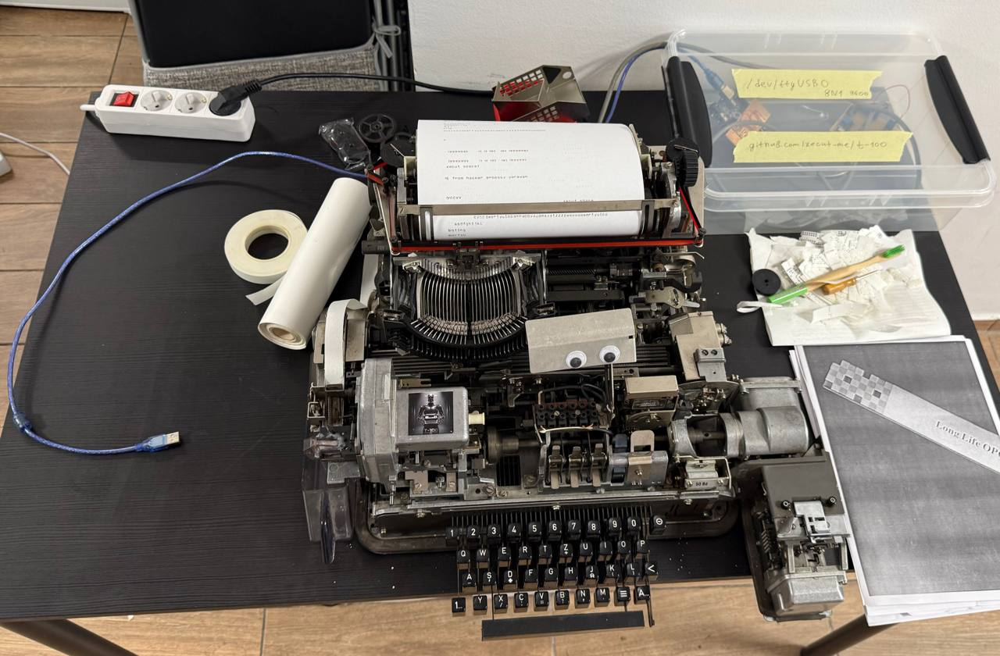
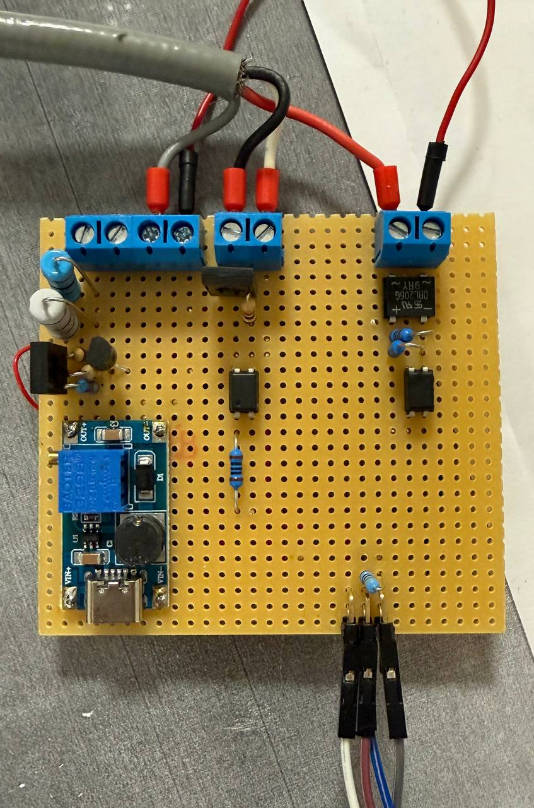
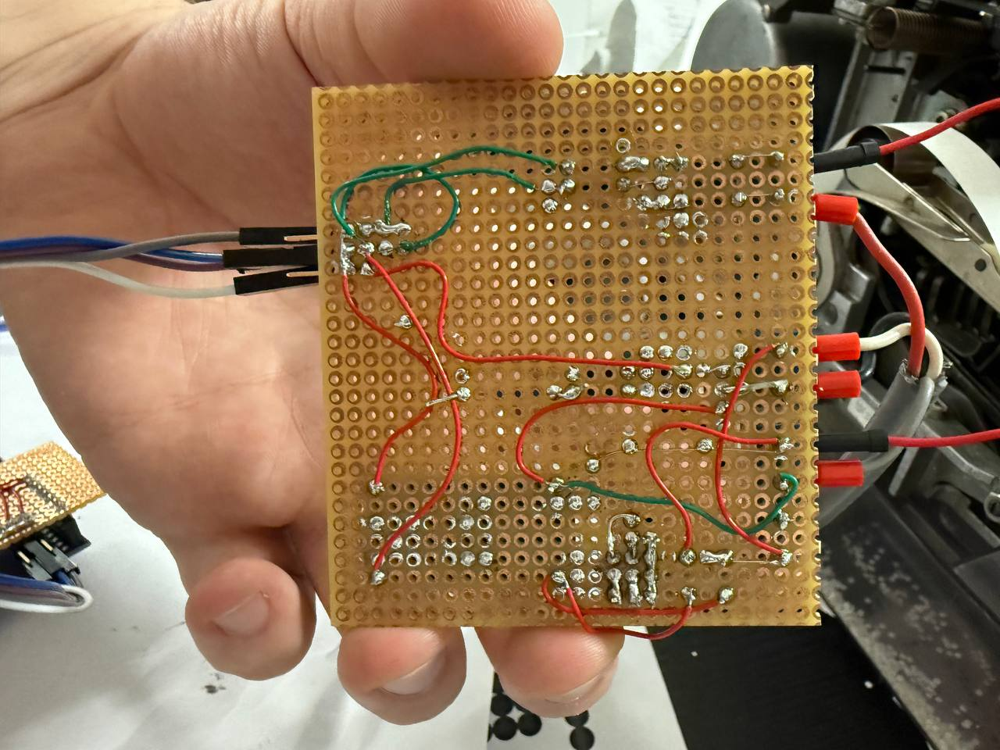
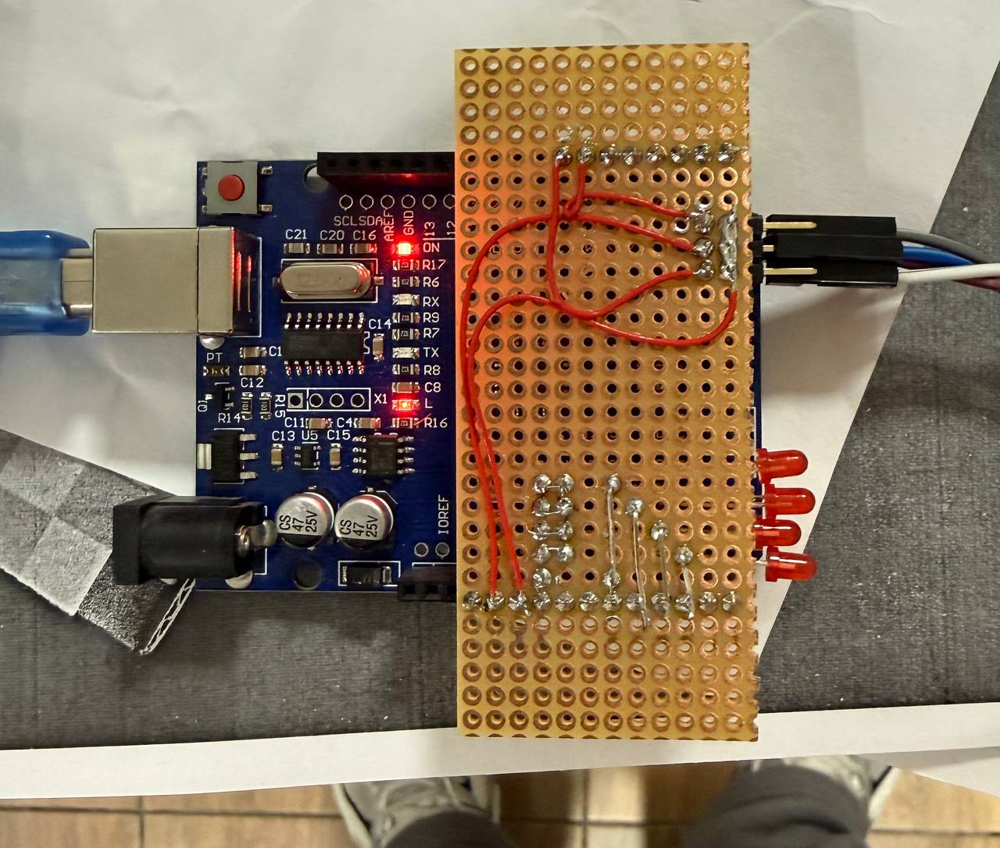
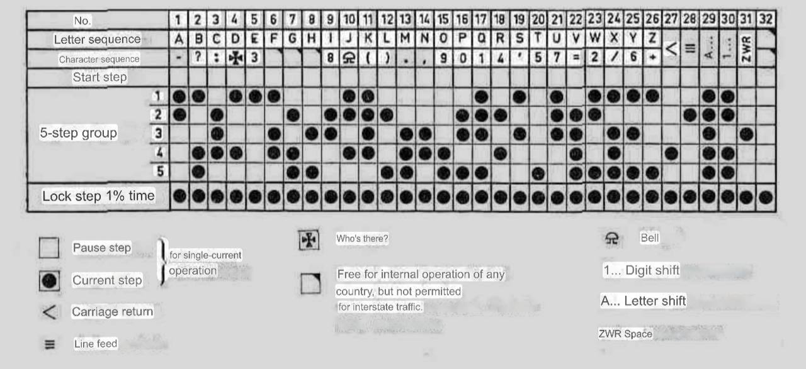

# Siemens Teleprinter 100

Это [телетайп](https://ru.wikipedia.org/wiki/%D0%A2%D0%B5%D0%BB%D0%B5%D1%82%D0%B0%D0%B9%D0%BF) 1963 года, который мы купили и поставили в хакспейсе. Кстати tty в линуксе берется именно отсюда.

Суть телетайпа в том, что это как печатная машинка, но подключенная по телеграфной линии. То, что печатается на клавиатуре, уходит по проводам, а то что приходит печатается на бумаге

# Режимы работы

## USB

### Установка

sudo usermod -aG dialout $USER

Выйти и зайти снова в систему

minicom -D /dev/ttyUSB0 -b 9600

Внутри миникома Ctrl+C не будет работать, надо Ctrl+A нажать и далее кнопки:
- Z это справка
- X это выйти
- Q это выйти если телетайп отвалился

### AI печатная машинка

Задать переменные окружения LLAMA_API_URL и LLAMA_API_KEY

Пример LLAMA_API_URL https://localhost:8080/v1/chat/completions

sudo stty -F /dev/ttyUSB0 9600 cs8 -parenb -cstopb -ixon -ixoff -crtscts -echo raw

stdbuf -i0 -o0 -e0 python3 ./t100-gpt.py </dev/ttyUSB0 >/dev/ttyUSB0

### Как работает

Работает на arduino, см teletype1.ino и convert.h

Скорость: 9600 8n1, без flow control (TODO: сделать xon/xoff)

В данный момент не реализованы задержки на cr/lf и пробуждение телетайпа

В системе скорее всего определяется как /dev/ttyUSB0

## Loopback

Подключается токовая петля и тогда то что уходит, то и приходит. TODO: картинки

### Схема

<table width="100%">
  <tr>
    <td></td>
    <td></td>
  </tr>
  <tr>
    <td></td>
    <td></td>
  </tr>
</table>

## Используемый код

Используется [код Бодо ITA2](https://ru.wikipedia.org/wiki/%D0%9A%D0%BE%D0%B4_%D0%91%D0%BE%D0%B4%D0%BE#ITA2)

# Схемотехника

[Схема в circuit.js](https://www.falstad.com/circuit/circuitjs.html?ctz=CQAgjAzCAMB00IQVhBJsBs0BMAWDWGA7NEUQJxghLTXW1ICmAtGGAFABKMI5GIzDLl79atXLTw8xsJOwBOIPLWLZUEfqp4boCkZKT8+tMOTUnyuxUjBrKam3aKjwADl0BzfSFdgjWH1xXaXYAdxAhSQkI6OxDGHYAExiDTVjXYLVExgAzAEMAVwAbABdmIsZE9lwwWghoYTNgiVpXPnAcFAA-ABUAGVwIKmgAHQBnaIxxsBZbcbgiCDQMbEgkclcyWyR5+Yjx7FnsceY4V1xV3DNyG4bN6AhdsbFpk7OLsCvsG8sgkkfnrBFstVmgNls4tMJOMuiUioMZolmABHAB2AH1KjBxhBsO5sWNlC8xkRsAgCUtYEtqTTaZpprBDqxjoDSWwyEMkN91v8nioDrBcEc3vBEBpFoZyIsMmAkEQwK4ds89qMxmARYgHsRllKIDK5QqlQtVmAObLuVKHlDVbD4UNKiiMQ6AIJgRkEhWwBXe3y+n37QmMzXB4MQYWA4iuXFIVzEOVgzZ8gO4QUhtMzZnzeB+KVxGqm4E0QZJ1XqwHQHOkpD5jloBoAuCR6Oxojx9aJtXQsa2hEOtGYpHO7Du1XuYmTabhhYPChIQxYchclZJqaE8OnWCuMmxvj1dy2KVGlWvMYbrfQHcYPcV76trP-Wfz6CL7DLzs2uG9pH9rGqlrj-k1SnIEGlWasICuRco3OFcDnXOBamgLkGk+CRqyIXwSxPDdEOQmpcDQ3AMLLacPnAyCYz1XBrRhT97W-J1klHQCmFYBsgTJUkCEVCAbgItBYKAzNTwWDDKHWGhyCWbB5VcLC1RFMg2llRdn2k2T70418MB4vjBiVT4PztRFHQHZhnTgFBmIDDM5hEkDcT4dxKC3ChqOVZ4AzDYS4E1RVNhoB5sDiXFTAbY9TxI0UEH81sEFxELVikxSgqc58FRk8h3KwWjjL7AAHAcCXxVdbJZDd-hwXMlnuUgSL2VdvLst01LQc4iP4tAY3k1gGVamMCKITq5zk+zKtvbAapIOrxhy7s6JM5FCt-cYx2K8k-0Asr71lJBcT1WwZPlIjBKZOzWE3II-C619VlbUbVWJMsLvOXwrznW7TW61ldv23xgq2E731yr9TJWtUaGKgNWLshYdNqCDLA2Z85Xcx6bNmZ7hzlPhFj8ZD1khDynpObGKG1fGyUJo0gXhh4rmfZzUZo+a8oYsznSs6ZNQJCchPOlroCwAiKwwojbCCU7w2HAKiOcJYyHE6tZnCzzSwFWWyCvCBFd2oU2JOQXhYkU1znlPBRsMkH6LB5IWR7G3EiK0tECUa2TKdrFSsxhlXsgE2NmrPwiCl1hnoQ5AKwgvGhq5WM+T0f3hC0JOIgvbR6jCcAhjUFOIOT0kEnCSBbB8Pxs7xMvRCzyBK7e7OAnr3QddoYxwFLtvTX4KAxCzzuzG8Lui8HjuAnaXRwkcEACOCKeWgSIpvBkuwAlxMQYCpQK01DDfNSEOJfl4jRlEXYe2+Xpf4gn7w15vnSEgAN3AIsQEWfhZQaCJC+EFBIas6RZA13zmnYIH9k7p2vmAkBz9P5aEgToKu4ALjCCbjXZBiCoGoOLi-euUC34JEUK9agA8iEYCvh0XQABjQIwQtBENJOIJQsht4hn1kQJQKYKyQHzrgQwbQtw91FMMLOpD4ikMLroZItQpC32kcIZQShwAADkWi4GqA8JB6c47Pw0MQ8w4ByDoiEOiaA6IJA3HREgEx8A4jolYOibA6JTDoggOoqAtRJjCFsPiUw+jbBGNwCYsxz5DESGsUhOxYAHFOMca4iQ7jID8HnrYIQ09UkqACUE8xoTTG+SFrY+xEBLFBKsUUvoABRAAIlnKeCjIgcN7uEep9Rk7pGCFYFIqAySdI0O0ihWdmndOaZ-a+c9yT1PntfCZ4zoi9ISPE7OA84jv2Ql09ejjjGmOyU43J8ArH2McbEmuOAvEDzkQ04ethy64JzogyBJyDErwsOYdgLd1D8DWksD57Qe7zI0XiYIVFp7lxnjwC4mSinbLCb5bYkSnHqPYbUQuYsKHBBRdIuQxc-DBFwasD55dIHYtfucdu98SDCEJWSz+bB75wJrkSvOpc6U1FbgPBhvAB71KoL0AYQxeZbXgvAEgKxZTkoQBcdwqtAJnXKghK83IZJbiELxWwIdiYehFNdBVGFXyDHsGqjcpB8mioaOKvEVpgas1Bj+JiOJzUEiJASBhxJKS0jddSekapGTAVIINMheohDOHQmq9Gq5hz6zssOFpOslgxnJoqBUPt1Xq0DNGwsmwnI2FcEm3yQ0iL+tjPm4NLMHaLUYuZN05hpiuC9H6Ot-ow1BhYZqJqLJc1+r2ouPiOq0YNXGCmf8zbtqRVFAQZwnwuRkg2BgFg5B5LPSNsQDAE7gqMxncwOd5Y81Bt4usLKPaS0LT7OWocI5VobX7QK4ShqyHejAkEPEFAQ19rXNeuA3xlnnjMMuvUGh50ig-Xwqdr5IBRlXDerNVzqxbgzWqq2VqbY2v5ReiYV7YZCo7bxHSCAryylDudXyt7-qgWAwReqatsKEcg2SC4pGahZl9UWrDY5cMGS7KW49ztz3QxVgx7dBaKyUA6s+zy3sfKMnErKGephgSxlXOjFN77JPViurqAN8mMNMf3EJoacH2NHvZi6Sy60MbidMBsLKgVl0EFvA9F9raTgYCBPLSaWUhBsHFDmiKvVTxOa1vtNz+ZPNhyzOZtovCcN+BWFKUac0OPfmWrasYJVJxmZuOFmgH8soXD1IJBzgIBoXg0FcNgZtl09SioVsDJWFT5qimFyzFZJIEUmrFoy1rEvrWJGtTapmCOMlNA8cLq68XEF7aJuCb6qTnAVDpwwk0-ANH-fZKis3PithWEMYWAHBt6iyiNqLQ1D1s1th6SGo4ePCQgF6T6BAroleCuuuzE3+bhy9MQD+VN3B4D4G2iKb3g6faQt9q4b5rspNG-d+wr4WCW30ydm15kuZqh5r1sT-XV1tADYWqUvD5MvplSca7vFcZIQi2JOWsxHr-aJ1SG4xAyc0Ap2QKnAHtxSVjDj2OpV4fWsYm7BDHsuMo-JPbAzzBPbJHR1FVbykiJ4DxJ2-Db2hbUdAvgMhM4E7FweTpUBpBc4ZEuQbiIRukVqBRboEo3gyFGErrbxRVBmCTU3CpyIsYrN6g3lql8YklikD2u48k2R8jFBKHoJoiDI-4JUNfSP9c25YI5RbrkyfX66Lj2y3R0eM-HPTg785Dv7lSAL7ro3ceAgO6lJoK+fd7eFxz9XcIkf6mR7lE33gld2-eG7x02o8QsCgPNNAuomcdcl-iIXiBxyS-p375oaf3BSvgNAZNXOECwUMGkBvTF7dU+D-biSg-18iGExodQZwfyoB69fqn+uTdqBFM2cEixVjfL7KiY4vaLi+6N3LucpPAA--E3VBBZVsNQUFDIBgUuBgDZQJDAF-VwYJaxKJexDgcIU-S-NvS-TwagUuDxaAtQWocvM+AIbvNuOZXQbgKAnwVockfEdeWIClABXfGg-ERPRpbwdgseauFSPA3OKQKeFTCIJQEwZtJhXfIQgifg6eIIYeKeFYH+JlWvN5KeVCGQ3xVAEISefA6QqeceGpfAgeWpaIKgpQQubvYKH+HAxRP+bfSyLOC+bvUHC-auRQfAYQNACA1JAFHgMka+DwpQI3QIhRAInw6IEwzgwIrwtJYQSZLOQI+eMZTg+hbpehXPDAuQ-BRvM+S-UvfPWvBZc3cwog-w95PwpA5-KFXZCJA5BxJA1xcfTw7pc5SgmfTw++Cg++AI8udofQjvVuJJXojvNQ01GQ6veQjuUuKeHrdga3UFdlKedlIggQT0JYQYKMc1LbCCKyS6KdRAfwuMXhChEAMYfKAAS0oRYBD0KFKEMIt0-gUNr3CC+Q6BkV0QIOHleM+NGNMKzjmTbhqH8CiOGPEGuQ2gSPBMINoKiKyO6VePZWvleK0ARJGS4AuRTk5QkU3zoHXgcJeN0XJXKMRP+N0U+UJO6VGVLjWiWNzwWQvkW2nlFykFaDgJcRfxyXCQ-3hSAA)

# Оригинальная документация

- t100fullmanual.pdf - для человеков
- t100fullmanual.txt - OCR as is, для LLM-ок

# Тематические стикеры

# Фича с отправкой своего адреса

Есть спец код который посылаешь 2 раза и машина печатает свой адрес

Адрес кодируется вот такими пинами

# Прочая информация

1.8W raspberry
4.2W raspberry + arduino

## Форматтеры

- autopep8
- clang format
